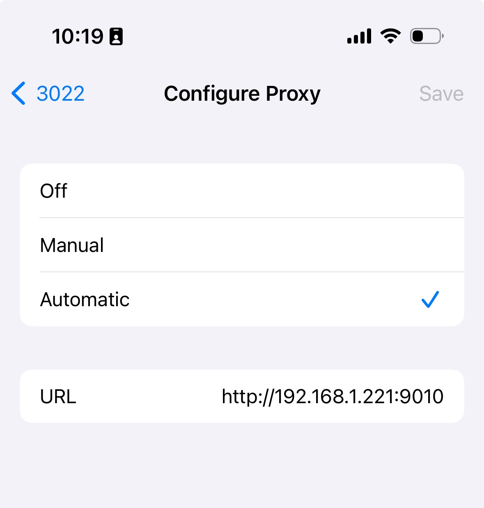

# ProxyPacPy

If you want to perform an MITM investigation of some network traffic or
you want to redirect your traffic through a remote SSH gateway it can
make life easier if you have a PAC file server.

This is a just such a Proxy PAC server.

    usage: proxypac.py [-h] [--verbose] IP_ADDRESS PORT TYPE

    A little Proxy PAC server

    positional arguments:
      IP_ADDRESS
      PORT
      TYPE

    options:
      -h, --help  show this help message and exit
      --verbose

## Example:

Start your SSH Socks Proxy on local machine or [Charles](https://www.charlesproxy.com)

    ssh -g -N -D 8889 <remote ssh server>

Pro-tip: Charles is much, much faster and you can see all of the sites the client is contacting. The number of advertising servers a typical website makes your device contact is pretty outrageous.
    
Start the PAC Proxy Server

    $ ./proxypac.py 192.168.1.221 8889 socks
    Server start at 192.168.1.221:9010. Happy hunting!

    Use this address for your device proxy settings:
    http://192.168.1.221:9010

Configure the iPhone's proxy settings

## Note

If you see garbled text occasionally in the console and some 400 errors
that is the phone trying to switch to SSL. It is safe to ignore it.
